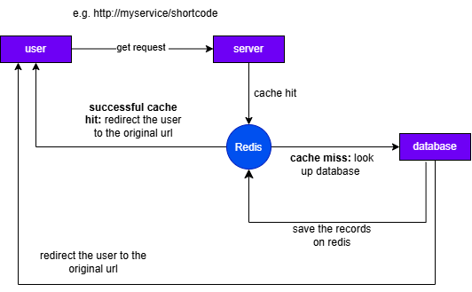

# URL SHORTENER SYSTEM
A backend URL shortener built with Java and Spring Boot.

I built this project to get more hands-on experience with backend development and, more importantly, to understand how different parts of a backend system work together. Instead of just storing URLs in a database, I wanted to experiment with caching, Redis, database synchronization, Docker, and application monitoring.

The basic idea is simple: give the service a long URL, get a short URL back, and use that short URL to redirect to the original one.

## How It Works
The application uses PostgreSQL as the main database and Redis for caching and click tracking. Additionally it also uses micrometer, prometheus and grafan for monitoring the application.

When a user creates a short URL, the URL mapping is stored in PostgreSQL. A short code is generated using Base62 and returned to the user.

When someone accesses the short URL, the application first checks Redis. If the URL is already cached, it can be returned without querying PostgreSQL.

## Why I Used Redis
URL shorteners are mostly read-heavy. A popular short URL could potentially be accessed thousands of times while the actual URL mapping rarely changes.

Because of that, querying PostgreSQL every time isn't ideal.

I use Redis as a cache:

## click tracking
The service also keeps track of how many times each shortened URL has been accessed.

Rather than updating PostgreSQL on every single request, I use Redis to increment the click count.

A scheduled process periodically moves the accumulated click counts from Redis into PostgreSQL.

This means the database doesn't have to handle a write for every redirect.

I also use a rename-based approach during synchronization so that the counter being processed is separated from the counter that is still receiving new clicks.

