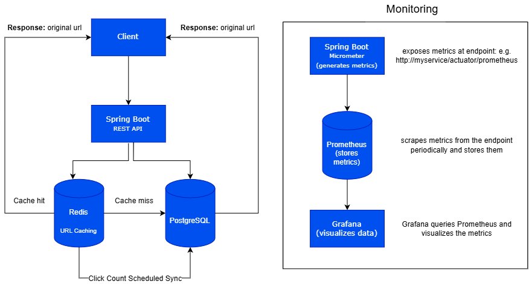

# URL SHORTENER SYSTEM
A backend URL shortener built with Java and Spring Boot.

I built this project to get more hands-on experience with backend development and, more importantly, to understand how different parts of a backend system work together. Instead of just storing URLs in a database, I wanted to experiment with caching, Redis, database synchronization, Docker, and application monitoring.

The basic idea is simple: give the service a long URL, get a short URL back, and use that short URL to redirect to the original one.

## How It Works
The application uses PostgreSQL as the main database and Redis for caching and click tracking. Additionally it also uses micrometer, prometheus and grafan for monitoring the application.

