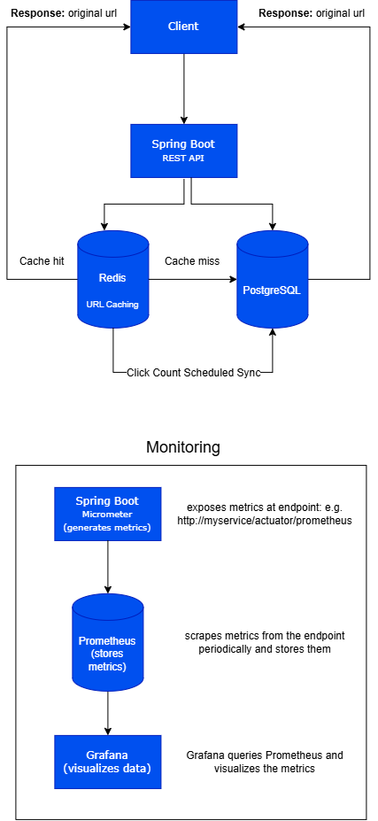
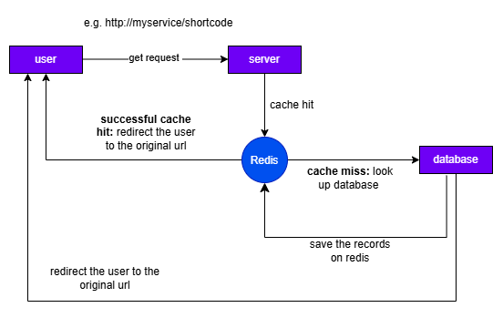
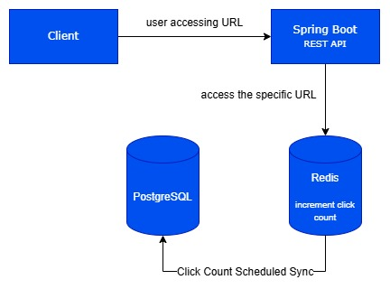
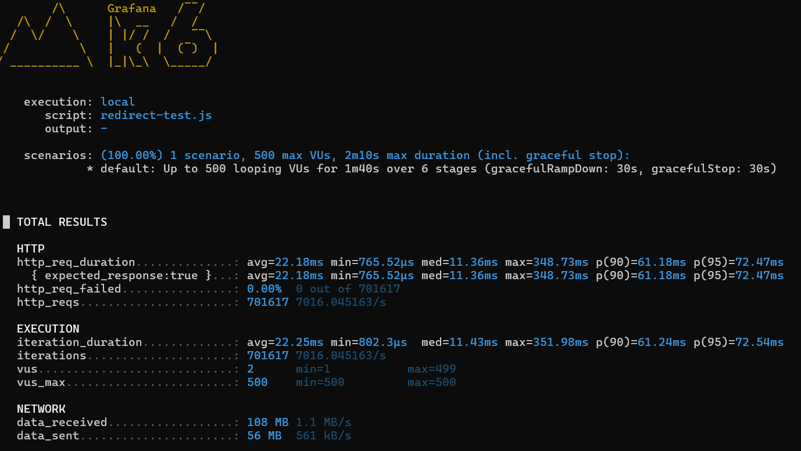
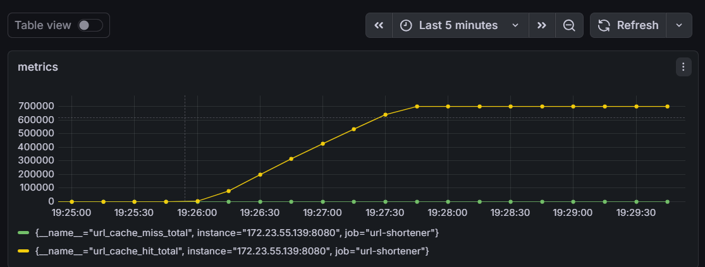

# URL SHORTENER SYSTEM
A backend URL shortener built with Java and Spring Boot.

I built this project to get more hands-on experience with backend development and, more importantly, to understand how different parts of a backend system work together. Instead of just storing URLs in a database, I wanted to experiment with caching, Redis, database synchronization, Docker, and application monitoring.

The basic idea is simple: give the service a long URL, get a short URL back, and use that short URL to redirect to the original one.

## How It Works
The application uses PostgreSQL as the main database and Redis for caching and click tracking. Additionally it also uses micrometer, prometheus and grafan for monitoring the application.



When a user creates a short URL, the URL mapping is stored in PostgreSQL. A short code is generated using Base62 and returned to the user.

When someone accesses the short URL, the application first checks Redis. If the URL is already cached, it can be returned without querying PostgreSQL.

## Why I Used Redis
URL shorteners are mostly read-heavy. A popular short URL could potentially be accessed thousands of times while the actual URL mapping rarely changes.

Because of that, querying PostgreSQL every time isn't ideal.

I use Redis as a cache:



## click tracking
The service also keeps track of how many times each shortened URL has been accessed.

Rather than updating PostgreSQL on every single request, I use Redis to increment the click count.



A scheduled process periodically moves the accumulated click counts from Redis into PostgreSQL.

This means the database doesn't have to handle a write for every redirect.

I also use a rename-based approach during synchronization so that the counter being processed is separated from the counter that is still receiving new clicks.

## Testing performance
I used k6 to load test the GET /{shortCode} redirect endpoint, which is the main read path of the service.

The test ramped up to 500 virtual users and generated 701,617 requests. The service handled all requests successfully with a 0% failure rate.



### Test Results
- Virtual Users: 500
- Total Requests: 701,617
- Average Response Time: 22.18 ms
- Median Response Time: 11.36 ms
- 95th Percentile: 72.47 ms
- Maximum Response Time: 348.73 ms
- Failed Requests: 0%

### Cache Performance

I also used Prometheus and Grafana to see how Redis performed during the test.

The test recorded around 701,000 cache hits and 0 cache misses. Since the URL being tested was already cached in Redis before the test started, the requests were served directly from the cache.



## Tech Stack

| Technology | What I used it for |
|------------|--------------------|
| Java | Backend development |
| Spring Boot | REST API and application framework |
| PostgreSQL | Persistent data storage |
| Redis | Caching and click counters |
| Docker | Running infrastructure |
| Docker Compose | Managing local services |
| Micrometer | Application metrics |
| Prometheus | Collecting metrics |
| Grafana | Visualizing metrics |
| Maven | Build and dependency management |


# Running the Project

## Requirements

You'll need:

* Java
* Maven
* Docker
* Docker Compose

## Start the Infrastructure

Start the required infrastructure services with:

```bash
docker compose up -d
```

This starts services such as **PostgreSQL** and **Redis**.

Then start the Spring Boot application from IntelliJ or with:

```bash
./mvnw spring-boot:run
```

The API will be available at:

```text
http://localhost:8080
```

---

# What I Learned

The main goal of this project wasn't just to build a URL shortener.

While building it, I gained experience with concepts that aren't always obvious when working on smaller projects:

* Designing a backend with multiple layers
* Working with PostgreSQL and Redis together
* Understanding when caching is useful
* Handling frequently updated data with Redis
* Synchronizing data between Redis and PostgreSQL
* Containerizing infrastructure with Docker
* Adding application metrics
* Using Prometheus and Grafana for monitoring
* Thinking about performance and database load
* Debugging networking issues between Docker, WSL, and the application

---

# Why I Built This

I wanted a project where I could go beyond building simple CRUD endpoints and actually think about **how a backend behaves under real usage**.

The URL shortening problem is simple enough to understand, but it also creates opportunities to work with caching, database design, concurrency, monitoring, and system performance.

That's what made it a useful project for me to learn from.


